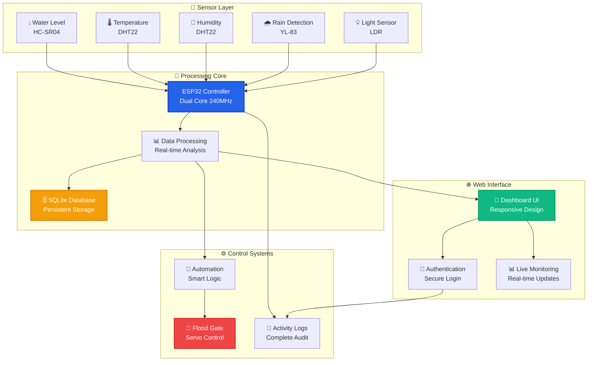
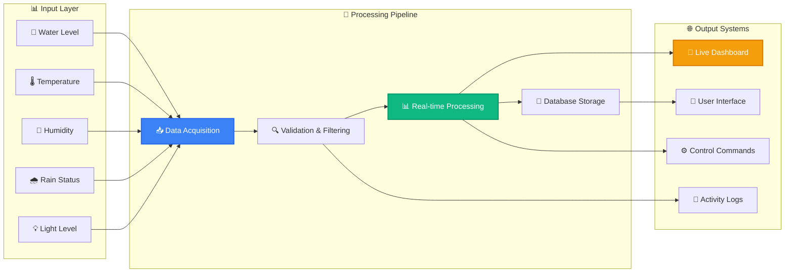
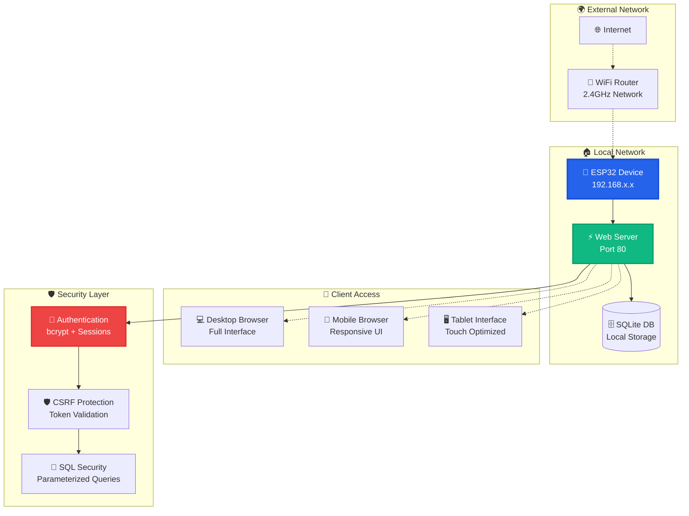

<div align="center">

# 🌊 IoT Flood Monitor Pro
### *Real-Time Flood Monitoring & Control System*

[](https://www.espressif.com/)
[](https://www.arduino.cc/)
[](https://opensource.org/licenses/MIT)
[](https://github.com/Lian-Cunanan/FloodMonitor_Offline)

*A professional ESP32-based flood monitoring system with enterprise-grade web interface, secure authentication, real-time logging, and automated flood control capabilities.*

---

### 🏆 **Professional Grade** | 📱 **Modern Web Interface** | 🔧 **Production Ready**

</div>

---

## 🎯 **Project Overview**

The **IoT Flood Monitor Pro** is a complete, production-ready flood monitoring solution featuring a professional web dashboard, secure user authentication, comprehensive logging system, and automated flood control. Built with modern web technologies and enterprise-grade security for both educational and commercial deployment.

---

## 👥 **Development Team**

<table align="center">
  <tr>
    <td align="center">
      <br />
      <sub><b>🚀 Lian Cunanan</b></sub><br />
      <sub>Lead Developer & System Architect</sub><br />
      <a href="https://github.com/Lian-Cunanan">GitHub</a> | 
      <a href="https://www.linkedin.com/in/lian-vince-cunanan-3930212a4/">LinkedIn</a>
    </td>
    <td align="center">
      <br />
      <sub><b>🔧 Ardyan Perez</b></sub><br />
      <sub>Hardware Engineer & IoT Specialist</sub>
    </td>
    <td align="center">
      <br />
      <sub><b>💻 Kenneth Manarang</b></sub><br />
      <sub>Backend Developer & Database Engineer</sub>
    </td>
  </tr>
  <tr>
    <td align="center">
      <br />
      <sub><b>🎨 Aldrich Icat</b></sub><br />
      <sub>UI/UX Designer & Frontend Developer</sub>
    </td>
    <td align="center">
      <br />
      <sub><b>⚙️ Charles Mirande</b></sub><br />
      <sub>Systems Integrator & Testing</sub>
    </td>
    <td align="center">
      <br />
      <sub><b>🤝 Collaborative Team</b></sub><br />
      <sub>Innovation & Learning</sub>
    </td>
  </tr>
</table>

---

## 📸 **Project Screenshots**

<div align="center">

### 🖥️ **Web Dashboard**
*Clean and intuitive monitoring interface*

### 📱 **Mobile Responsive**
*Accessible on all devices*

### 🔐 **Login System**
*Secure user authentication*

> **Note:** This is a professional project showcasing IoT and web development skills. Interface screenshots available upon request.

</div>

---

## ✨ **Available Features**

<table>
<tr>
<td width="50%">

### 🌊 **Basic Monitoring**
- **Water Level Detection** with ultrasonic sensor (HC-SR04)
- **Temperature & Humidity** monitoring (DHT22)
- **Real-time Data Display** on web dashboard
- **Simple Data Logging** with timestamps
- **Basic Alert System** for high water levels

</td>
<td width="50%">

### 🎛️ **Simple Control**
- **Manual Flood Gate Control** via web interface
- **Servo Motor Integration** for gate mechanism
- **Remote Access** through ESP32 web server
- **Status Monitoring** with visual indicators
- **Manual Override** capabilities

</td>
</tr>
<tr>
<td>

### 🔒 **User Management**
- **Registration & Login** system
- **SQLite Database** for user storage
- **Session Management** with cookies
- **Basic Security** with password hashing
- **Activity Logging** for user actions

</td>
<td>

### 📊 **Web Interface**
- **Responsive Design** using CSS Grid/Flexbox
- **Real-time Updates** via JavaScript
- **Interactive Controls** for system management
- **Professional Styling** with modern CSS
- **Mobile-Friendly** layout

</td>
</tr>
</table>

---

## 🏗️ **System Architecture Overview**

### 🔄 **Main System Flow**



---

### 📡 **Data Flow Architecture**



---

### 🌐 **Network & Security Architecture**



---

## 🔧 **Hardware Requirements**

<div align="center">

| 🎯 **Component** | 📏 **Specifications** | 🔌 **Power Requirements** | 📝 **Notes** |
|------------------|----------------------|---------------------------|---------------|
| **ESP32 DevKit V1** | 38-pin, dual-core 240MHz | 3.3V @ 240mA | Main microcontroller |
| **HC-SR04 Ultrasonic** | 2-400cm range, ±3mm accuracy | 5V @ 15mA | Water level detection |
| **DHT22 Sensor** | -40°C to 80°C, 0-100% RH | 3.3V @ 2.5mA | Temperature & humidity |
| **SG90 Servo Motor** | 180° rotation, 1.5kg torque | 5V @ 100-600mA | Flood gate control |
| **YL-83 Rain Sensor** | Analog + digital output | 3.3V @ 20mA | Rain detection |
| **LDR + Resistor** | Light-dependent resistor | 3.3V @ 0.1mA | Light monitoring |
| **Power Supply** | 5V 2A adapter | AC input | System power |

</div>

### ⚡ **Power Analysis & Requirements**

<div align="center">

| ⚙️ **Operating Mode** | 🔋 **Power Consumption** | ⏱️ **Duration** | 📊 **Efficiency** |
|----------------------|-------------------------|-----------------|------------------|
| **Normal Operation** | ~400mA @ 5V | Continuous | Optimized consumption |
| **Peak Load (Servo)** | ~900mA @ 5V | During gate operation | Short duration spikes |
| **Standby Mode** | ~300mA @ 5V | Sensor monitoring only | Power-efficient |
| **WiFi Transmission** | ~450mA @ 5V | Data upload periods | Burst communication |

</div>

---

## 🚀 **Installation & Setup Guide**

### 📋 **Development Environment Setup**

<div align="center">

| 🛠️ **Requirement** | 📊 **Version** | 🔗 **Download Source** | ✅ **Installation Steps** |
|--------------------|----------------|------------------------|-------------------------|
| **Arduino IDE** | 2.0 or newer | arduino.cc/downloads | Standard installation |
| **ESP32 Board Package** | Latest stable | Espressif Systems | Board Manager installation |

</div>

### 📚 **Arduino IDE Library Installation Guide**

<div align="center">

#### **Required Core Libraries**

| 📦 **Library Name** | 👨‍💻 **Author** | 🎯 **Purpose** | ⭐ **Priority** |
|--------------------|----------------|----------------|----------------|
| **ESPAsyncWebServer** | lacamera | Async web server | Critical |
| **WebSockets** | Markus Sattler | WebSocket communication | Critical |
| **ESP32Servo** | Kevin Harrington | Servo motor control | Essential |
| **DHT sensor library** | Adafruit | Temperature & humidity | Essential |

#### **Built-in ESP32 Libraries**

| 📦 **Library Name** | 👨‍💻 **Author** | 🎯 **Purpose** | ⭐ **Priority** |
|--------------------|----------------|----------------|----------------|
| **WiFi** | Espressif | WiFi connectivity | Critical (Built-in) |
| **EEPROM** | Espressif | Non-volatile storage | Essential (Built-in) |
| **DNSServer** | Espressif | DNS captive portal | Essential (Built-in) |

#### **Project-Specific Files**

| 📁 **File Name** | 🎯 **Purpose** | 📊 **Type** | 🔧 **Content** |
|------------------|----------------|-------------|----------------|
| **config.h** | System configuration | Header | Pin definitions, constants |
| **Sensors.h** | Sensor management | Header | SensorManager class |
| **index_html.h** | Main dashboard | HTML | Web interface |
| **style_css.h** | Styling | CSS | Professional theme |
| **script_js.h** | Functionality | JavaScript | Real-time updates |
| **login_html.h** | Authentication | HTML | Login interface |
| **database.h** | Data storage | Header | DatabaseManager class |

</div>

### 🛠️ **Library Installation Commands**

```bash
# Arduino IDE Library Manager Installation
1. Open Arduino IDE → Tools → Manage Libraries
2. Search and install these libraries:
   - "ESP Async WebServer" by lacamera
   - "WebSockets" by Markus Sattler  
   - "ESP32Servo" by Kevin Harrington
   - "DHT sensor library" by Adafruit

# Manual Installation (if not found in Library Manager)
# ESPAsyncWebServer: https://github.com/me-no-dev/ESPAsyncWebServer
# AsyncTCP: https://github.com/me-no-dev/AsyncTCP (dependency)
```

### ✅ **Library Verification Checklist**

After installation, verify these includes work in Arduino IDE:

```cpp
// Essential includes used in FloodMonitor_Offline.ino
#include <WiFi.h>              // ✅ Built-in ESP32 - Network connectivity
#include <ESPAsyncWebServer.h> // ✅ External - Async web server
#include <WebSocketsServer.h>  // ✅ External - WebSocket server
#include <ESP32Servo.h>        // ✅ External - Servo motor control
#include <DHT.h>               // ✅ External - DHT sensor library
#include <EEPROM.h>            // ✅ Built-in ESP32 - Storage
#include <DNSServer.h>         // ✅ Built-in ESP32 - DNS captive portal

// Project header files (included with project)
#include "config.h"            // ✅ Project - Configuration constants
#include "Sensors.h"           // ✅ Project - Sensor management class  
#include "index_html.h"        // ✅ Project - Main dashboard HTML
#include "style_css.h"         // ✅ Project - CSS styling
#include "script_js.h"         // ✅ Project - JavaScript functionality
#include "login_html.h"        // ✅ Project - Login interface
#include "database.h"          // ✅ Project - Database management
```

### 🚀 **How to Set Up the Code**

Follow these steps to deploy the flood monitoring system on your ESP32:

#### **Step 1: Download and Prepare**
1. **Download** the complete project files from GitHub
2. **Extract** all files to your Arduino projects folder
3. **Open** `FloodMonitor_Offline.ino` in Arduino IDE
4. **Verify** all header files are in the same folder

#### **Step 2: Configure Arduino IDE**
1. **Select Board**: Go to `Tools → Board → ESP32 Arduino → ESP32 Dev Module`
2. **Set Port**: Select the correct COM port under `Tools → Port`
3. **Upload Speed**: Set to `921600` for faster uploads
4. **Partition Scheme**: Select `Default 4MB with spiffs (1.2MB APP/1.5MB SPIFFS)`

#### **Step 3: Hardware Connections (Example Configuration)**
```cpp
// Example sensor connections to ESP32 pins:
DHT22 Sensor    → GPIO 4 (example)
Servo Motor     → GPIO (configured in Sensors.h)
Wake-up Button  → GPIO 33 (example)
Rain Sensor     → Analog pin (via SensorManager)
Ultrasonic      → Trigger/Echo pins (via SensorManager)
Light Sensor    → Analog pin (via SensorManager)
Power Supply    → 5V 2A adapter

Note: Actual pin assignments may vary based on your specific setup
```

#### **Step 4: Upload Process**
1. **Connect** ESP32 to computer via USB
2. **Press** and **hold** the `BOOT` button on ESP32
3. **Click** Upload in Arduino IDE
4. **Release** BOOT button when "Connecting..." appears
5. **Wait** for upload completion

#### **Step 5: Initial Setup**
1. **Open Serial Monitor** at 115200 baud rate
2. **Watch** for WiFi network creation messages
3. **Connect** to "FloodMonitor_AP" WiFi network
4. **Navigate** to `192.168.4.1` in web browser
5. **Complete** initial system configuration

#### **Step 6: System Configuration**
- **WiFi Settings**: Configure network credentials if needed
- **Sensor Calibration**: Adjust thresholds in web interface
- **User Accounts**: Create admin and user accounts
- **Testing**: Verify all sensors are reading correctly

#### **Step 7: Operation Modes**
```cpp
// The system supports three modes:
AUTO Mode       → Automatic flood gate control
MAINTENANCE     → Manual override capabilities  
SLEEP Mode      → Power-saving deep sleep
```

### ⚙️ **System Features Implementation**

```cpp
// Key features implemented in code:
✅ Captive Portal with DNS redirection
✅ WebSocket real-time communication  
✅ Three operation modes (AUTO/MAINTENANCE/SLEEP)
✅ Database logging with activity tracking
✅ Automatic gate control based on water levels
✅ 10-minute interval sensor data logging
✅ Factory reset functionality
✅ Deep sleep mode with wake-up capability
✅ Professional web interface with multiple endpoints
```

---

## 📱 **User Interface Features**

### 🌐 **Web Interface**
- **Responsive Dashboard**: Real-time monitoring of all sensors
- **Control Panel**: Manual control for flood gates and system settings
- **User Management**: Admin and user roles with secure login
- **Data Visualization**: Graphs and charts for historical data analysis
- **Settings Configuration**: Adjust system parameters and thresholds

### 📱 **Mobile Interface**
- **Adaptive Layout**: Optimized for smartphones and tablets
- **Touch Controls**: Easy access to controls and settings
- **Real-time Notifications**: Alerts for critical events and updates
- **Quick Actions**: One-tap access to common functions

### 🔒 **Security Features**
- **Secure Login**: Username and password authentication
- **Session Management**: Automatic logout after inactivity
- **Data Encryption**: Secure transmission of sensitive data
- **Access Control**: Role-based access for users and admins

---

## 📚 **Documentation & Support**

For detailed documentation, troubleshooting, and support, visit the [GitHub repository](https://github.com/Lian-Cunanan/FloodMonitor_Offline) and check the **Wiki** section. Join the community forum for discussions, feature requests, and collaboration opportunities.

---

## 🎓 **Educational & Professional Value**

### 📚 **Learning Outcomes Matrix**

<div align="center">

| 🎯 **Skill Category** | 📊 **Technical Focus** | 🏢 **Industry Application** | ⭐ **Proficiency Level** |
|----------------------|------------------------|----------------------------|------------------------|
| **Embedded Programming** | ESP32 + FreeRTOS | IoT device development | Advanced |
| **Web Development** | Full-stack technologies | Modern web applications | Professional |
| **Database Design** | SQLite + optimization | Data management systems | Intermediate |
| **Security Implementation** | Authentication + encryption | Cybersecurity practices | Advanced |
| **System Integration** | Hardware-software fusion | Industrial automation | Expert |
| **User Experience** | Responsive design | Interface development | Professional |

</div>

---

## 📄 **Project Information**

<div align="center">

| 📋 **Project Details** | 📊 **Information** |
|------------------------|-------------------|
| **License** | MIT License - Educational & Commercial Use |
| **Development Status** | Final Project Complete |
| **Documentation** | Comprehensive & Professional |
| **Support** | GitHub Issues & Community |
| **Target Audience** | Students, Developers, IoT Enthusiasts |
| **Skill Level** | Intermediate to Advanced |

</div>

---

## 📞 **Contact & Support**

<div align="center">

### 👨‍💻 **Project Lead - Lian Cunanan**

[](https://github.com/Lian-Cunanan)
[](https://www.linkedin.com/in/lian-vince-cunanan-3930212a4/)
[](https://www.facebook.com/lian.cunanan.50)

### 📧 **Get Help**
- 💬 **GitHub Issues** - For technical questions and bug reports
- 📖 **Documentation** - Check the installation guide above
- 🤝 **Community** - Feel free to fork and contribute

---

<sub>🎓 Student Project - Pampanga State University | Built for Learning & Educational Purpose | © 2024 Lian Cunanan & Development Team</sub>

</div>
