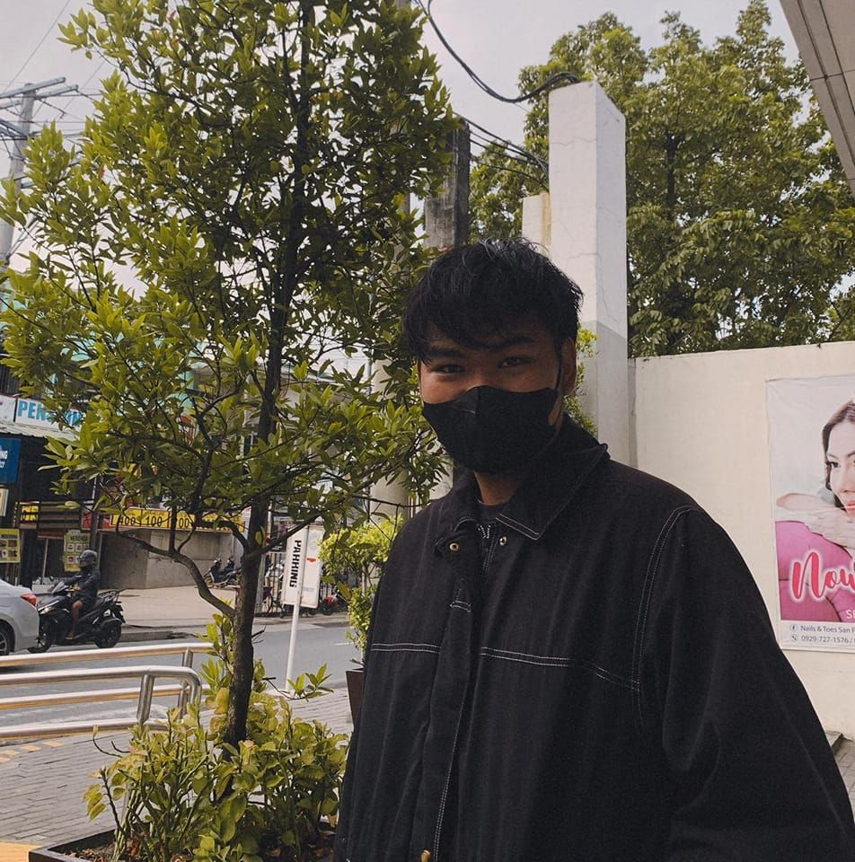
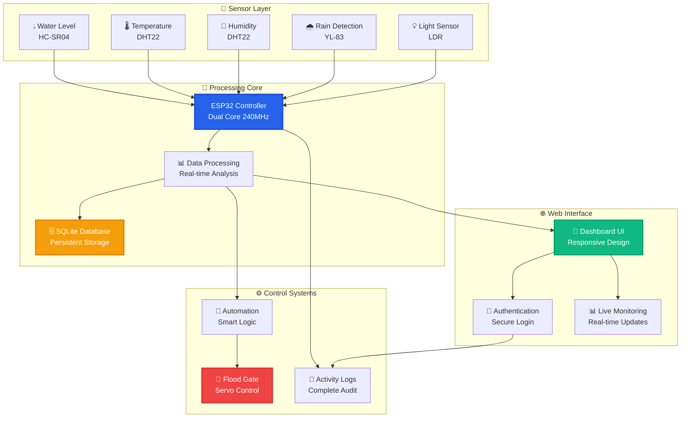
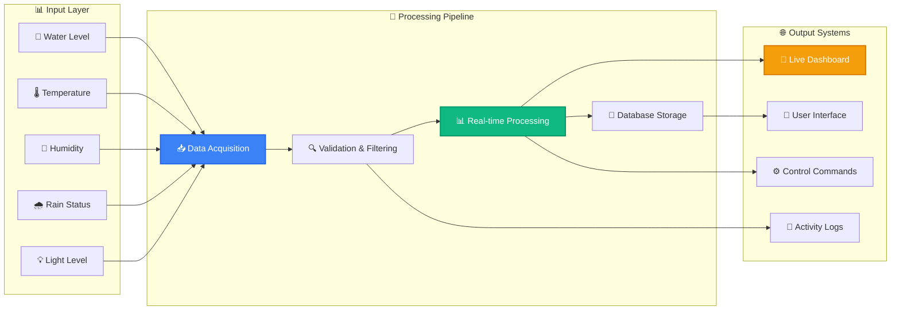
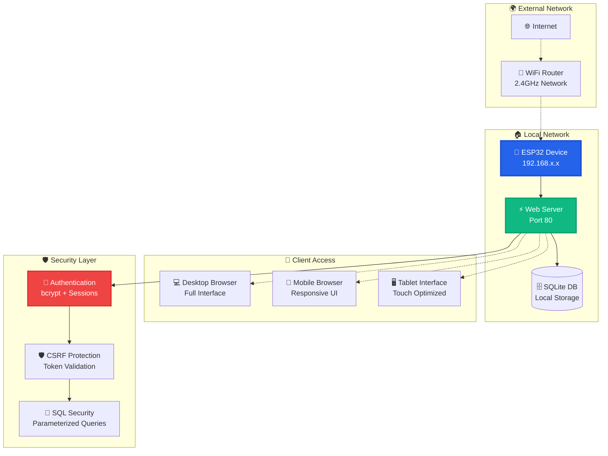

<div align="center">

# 🌊 IoT Flood Monitor Pro
### *Real-Time Flood Monitoring & Control System*

[](https://www.espressif.com/)
[](https://www.arduino.cc/)
[](https://opensource.org/licenses/MIT)
[](https://github.com/Lian-Cunanan/FloodMonitor_Offline)

*A professional ESP32-based flood monitoring system with enterprise-grade web interface, secure authentication, real-time logging, and automated flood control capabilities.*

---

### 🏆 **Professional Grade** | 📱 **Modern Web Interface** | 🔧 **Production Ready**

</div>

## 🎯 **Project Overview**

The **IoT Flood Monitor Pro** is a complete, production-ready flood monitoring solution featuring a professional web dashboard, secure user authentication, comprehensive logging system, and automated flood control. Built with modern web technologies and enterprise-grade security for both educational and commercial deployment.

## 👥 **Development Team**

<table align="center">
  <tr>
    <td align="center">
      <br />
      <sub><b>🚀 Lian Cunanan</b></sub><br />
      <sub>Lead Developer & System Architect</sub><br />
      <a href="https://github.com/Lian-Cunanan">GitHub</a> | 
      <a href="https://www.linkedin.com/in/lian-vince-cunanan-3930212a4/">LinkedIn</a>
    </td>
    <td align="center">
      <br />
      <sub><b>🔧 Ardyan Perez</b></sub><br />
      <sub>Hardware Engineer & IoT Specialist</sub>
    </td>
    <td align="center">
      <br />
      <sub><b>💻 Kenneth Manarang</b></sub><br />
      <sub>Backend Developer & Database Engineer</sub>
    </td>
  </tr>
  <tr>
    <td align="center">
      <br />
      <sub><b>🎨 Aldrich Icat</b></sub><br />
      <sub>UI/UX Designer & Frontend Developer</sub>
    </td>
    <td align="center">
      <br />
      <sub><b>⚙️ Charles Mirande</b></sub><br />
      <sub>Systems Integrator & Testing</sub>
    </td>
    <td align="center">
      <br />
      <sub><b>🤝 Collaborative Team</b></sub><br />
      <sub>Innovation & Learning</sub>
    </td>
  </tr>
</table>

## 📸 **Project Screenshots**

<div align="center">

### 🖥️ **Web Dashboard**
*Clean and intuitive monitoring interface*

### 📱 **Mobile Responsive**
*Accessible on all devices*

### 🔐 **Login System**
*Secure user authentication*

> **Note:** This is a professional project showcasing IoT and web development skills. Interface screenshots available upon request.

</div>

## ✨ **Available Features**

<table>
<tr>
<td width="50%">

### 🌊 **Basic Monitoring**
- **Water Level Detection** with ultrasonic sensor (HC-SR04)
- **Temperature & Humidity** monitoring (DHT22)
- **Real-time Data Display** on web dashboard
- **Simple Data Logging** with timestamps
- **Basic Alert System** for high water levels

</td>
<td width="50%">

### 🎛️ **Simple Control**
- **Manual Flood Gate Control** via web interface
- **Servo Motor Integration** for gate mechanism
- **Remote Access** through ESP32 web server
- **Status Monitoring** with visual indicators
- **Manual Override** capabilities

</td>
</tr>
<tr>
<td>

### 🔒 **User Management**
- **Registration & Login** system
- **SQLite Database** for user storage
- **Session Management** with cookies
- **Basic Security** with password hashing
- **Activity Logging** for user actions

</td>
<td>

### 📊 **Web Interface**
- **Responsive Design** using CSS Grid/Flexbox
- **Real-time Updates** via JavaScript
- **Interactive Controls** for system management
- **Professional Styling** with modern CSS
- **Mobile-Friendly** layout

</td>
</tr>
</table>

## 🏗️ **System Architecture Overview**

### 🔄 **Main System Flow**



### 📡 **Data Flow Architecture**



### 🌐 **Network & Security Architecture**



## 🔧 **Hardware Requirements**

<div align="center">

| 🎯 **Component** | 📏 **Specifications** | 🔌 **Power Requirements** | 💰 **Estimated Cost (PHP)** |
|------------------|----------------------|---------------------------|------------------------------|
| **ESP32 DevKit V1** | 38-pin, dual-core 240MHz | 3.3V @ 240mA | ₱400-600 |
| **HC-SR04 Ultrasonic** | 2-400cm range, ±3mm accuracy | 5V @ 15mA | ₱100-200 |
| **DHT22 Sensor** | -40°C to 80°C, 0-100% RH | 3.3V @ 2.5mA | ₱150-250 |
| **SG90 Servo Motor** | 180° rotation, 1.5kg torque | 5V @ 100-600mA | ₱100-200 |
| **YL-83 Rain Sensor** | Analog + digital output | 3.3V @ 20mA | ₱50-150 |
| **LDR + Resistor** | Light-dependent resistor | 3.3V @ 0.1mA | ₱30-100 |
| **Power Supply** | 5V 2A adapter | AC input | ₱250-400 |
| **📊 Total System Cost** | **Complete IoT Solution** | **Full Setup** | **₱1,080-1,900** |

</div>

### ⚡ **Power Analysis & Requirements**

<div align="center">

| ⚙️ **Operating Mode** | 🔋 **Power Consumption** | ⏱️ **Duration** | 📊 **Efficiency** |
|----------------------|-------------------------|-----------------|------------------|
| **Normal Operation** | ~400mA @ 5V | Continuous | Optimized consumption |
| **Peak Load (Servo)** | ~900mA @ 5V | During gate operation | Short duration spikes |
| **Standby Mode** | ~300mA @ 5V | Sensor monitoring only | Power-efficient |
| **WiFi Transmission** | ~450mA @ 5V | Data upload periods | Burst communication |

</div>

## 🚀 **Installation & Setup Guide**

### 📋 **Development Environment Setup**

<div align="center">

| 🛠️ **Requirement** | 📊 **Version** | 🔗 **Download Source** | ✅ **Installation Steps** |
|--------------------|----------------|------------------------|-------------------------|
| **Arduino IDE** | 2.0 or newer | arduino.cc/downloads | Standard installation |
| **ESP32 Board Package** | Latest stable | Espressif Systems | Board Manager installation |
| **USB Drivers** | Platform-specific | Device manufacturer | System-dependent setup |

</div>

### 📚 **Arduino IDE Library Installation Guide**

<div align="center">

#### **Required Core Libraries**

| 📦 **Library Name** | 👨‍💻 **Author** | 🎯 **Purpose** | ⭐ **Priority** |
|--------------------|----------------|----------------|----------------|
| **ESPAsyncWebServer** | lacamera | Web server functionality | Critical |
| **AsyncTCP** | dvarrel | Asynchronous networking | Critical |
| **ArduinoJson** | Benoit Blanchon | JSON data handling | Essential |

#### **Sensor Libraries (Choose Based on Your Sensors)**

| 📡 **Library Name** | 👨‍💻 **Author** | 🔧 **Compatible Sensors** | 🎯 **Usage** |
|--------------------|----------------|---------------------------|-------------|
| **OneWire** | Paul Stoffregen | DS18B20, DS2438 | Temperature sensors |
| **DallasTemperature** | Miles Burton | DS18B20 family | Digital thermometers |
| **NewPing** | Tim Eckel | HC-SR04, US-100 | Ultrasonic distance |
| **ServoESP32** | Jaroslav Paral | SG90, MG996R | Servo motor control |

#### **Optional Enhancement Libraries**

| 🌐 **Library Name** | 👨‍💻 **Author** | 📊 **Features** | 🚀 **Benefits** |
|--------------------|----------------|----------------|----------------|
| **NTPClient** | Fabrice Weinberg | Network time sync | Accurate timestamps |
| **PubSubClient** | Nick O'Leary | MQTT communication | IoT cloud integration |

</div>

### 🛠️ **Step-by-Step Installation Instructions**

<div align="center">

| 📋 **Step** | 🔧 **Action** | 📝 **Details** |
|-------------|---------------|----------------|
| **1** | Open Arduino IDE | Launch Arduino IDE 2.0+ |
| **2** | Access Library Manager | Go to **Sketch → Include Library → Manage Libraries** |
| **3** | Search Libraries | Search for each library name listed above |
| **4** | Install by Author | Select the correct library by the specified author |
| **5** | Restart IDE | Close and restart Arduino IDE after installation |

</div>

#### **Manual GitHub Installation**

For libraries not found in Library Manager:

<div align="center">

| 📦 **Library** | 🔗 **GitHub Repository** | 📁 **Installation Path** |
|---------------|-------------------------|-------------------------|
| **ESPAsyncWebServer** | `https://github.com/me-no-dev/ESPAsyncWebServer` | `Arduino/libraries/ESPAsyncWebServer/` |
| **AsyncTCP** | `https://github.com/me-no-dev/AsyncTCP` | `Arduino/libraries/AsyncTCP/` |

</div>

**Manual Installation Steps:**
1. Download ZIP file from GitHub repository
2. Extract to `Arduino/libraries/` folder
3. Restart Arduino IDE
4. Verify installation in **Sketch → Include Library**

### 🔗 **Alternative Installation Methods**

#### **Built-in ESP32 Libraries**

These libraries come pre-installed with the ESP32 board package:

<div align="center">

| 🔧 **Library** | 📊 **Purpose** | 🎯 **Usage in Project** |
|---------------|----------------|----------------------|
| **WiFi** | Network connectivity | Internet connection management |
| **WebServer** | HTTP server functions | Alternative to AsyncWebServer |
| **SPIFFS** | File system storage | Web files and configuration |
| **FS** | File system operations | File read/write operations |
| **Update** | OTA firmware updates | Remote code deployment |
| **Preferences** | Non-volatile storage | Settings and configuration |

</div>

### ✅ **Library Verification Checklist**

After installation, verify these libraries appear in your Arduino IDE:

```cpp
// Include test - Add to a new sketch to verify installation
#include <WiFi.h>              // ✅ Built-in ESP32
#include <ESPAsyncWebServer.h>  // ✅ Manual install required
#include <AsyncTCP.h>           // ✅ Manual install required  
#include <ArduinoJson.h>        // ✅ Library Manager
#include <NewPing.h>           // ✅ Library Manager (optional)
#include <ESP32Servo.h>        // ✅ Library Manager (for servo)
```

**🔍 Troubleshooting Library Issues:**
- **Library not found**: Check spelling and author name
- **Compilation errors**: Verify library compatibility with ESP32
- **Version conflicts**: Update to latest stable versions
- **Include errors**: Check library installation path

## 📱 **User Interface Features**

### 🎨 **Dashboard Components**

<div align="center">

| 🖥️ **UI Component** | 📊 **Functionality** | 📱 **Mobile Support** | ⚡ **Real-Time Updates** |
|--------------------|---------------------|---------------------|-------------------------|
| **Water Level Gauge** | Animated SVG circle | Touch-friendly | 3-second intervals |
| **Environmental Grid** | Live sensor data | Responsive layout | Continuous monitoring |
| **Gate Control Panel** | Interactive buttons | Large touch targets | Immediate response |
| **System Alerts** | Priority notifications | Mobile-optimized | Event-driven updates |
| **Action Center** | Quick access tools | Swipe gestures | Context-sensitive |
| **Live Logs Display** | Real-time activity | Scrollable interface | Auto-refresh |

</div>

### 🔐 **Authentication Interface**

<div align="center">

| 🔑 **Auth Feature** | 🎨 **Design Element** | 🛡️ **Security Measure** | 📱 **Mobile Experience** |
|--------------------|----------------------|------------------------|------------------------|
| **Login Form** | Two-panel layout | Secure credential handling | Touch-optimized inputs |
| **Registration** | Tabbed interface | Password strength validation | Real-time feedback |
| **Session Management** | Seamless transitions | Auto-logout protection | Background persistence |
| **Error Handling** | User-friendly messages | Brute force protection | Graceful degradation |

</div>

## 🐛 **Troubleshooting Matrix**

### ❌ **Common Issues & Solutions**

<div align="center">

| 🚨 **Issue Category** | 🔍 **Problem** | ✅ **Solution** | 🎯 **Prevention** |
|----------------------|----------------|----------------|------------------|
| **Network Connectivity** | WiFi connection failure | Check 2.4GHz network | Use strong passwords |
| **Sensor Readings** | Inconsistent data | Verify wiring/power | Use quality components |
| **Web Interface** | Page loading issues | Check IP address | Clear browser cache |
| **Upload Errors** | Code deployment fails | Select correct board | Close serial monitor |
| **Authentication** | Login problems | Reset credentials | Check database integrity |
| **Performance** | System lag | Monitor memory usage | Optimize code |

</div>

## 🎓 **Educational & Professional Value**

### 📚 **Learning Outcomes Matrix**

<div align="center">

| 🎯 **Skill Category** | 📊 **Technical Focus** | 🏢 **Industry Application** | ⭐ **Proficiency Level** |
|----------------------|------------------------|----------------------------|------------------------|
| **Embedded Programming** | ESP32 + FreeRTOS | IoT device development | Advanced |
| **Web Development** | Full-stack technologies | Modern web applications | Professional |
| **Database Design** | SQLite + optimization | Data management systems | Intermediate |
| **Security Implementation** | Authentication + encryption | Cybersecurity practices | Advanced |
| **System Integration** | Hardware-software fusion | Industrial automation | Expert |
| **User Experience** | Responsive design | Interface development | Professional |

</div>

### 🏢 **Industry Applications**

<div align="center">

| 🏭 **Industry Sector** | 🎯 **Application** | 📊 **Scale** | 🚀 **Implementation** |
|------------------------|-------------------|-------------|----------------------|
| **Municipal Services** | City flood monitoring | Large-scale | Emergency response |
| **Industrial Control** | Process monitoring | Medium-scale | Safety systems |
| **Smart Buildings** | Environmental control | Building-wide | Automation systems |
| **Agriculture** | Irrigation management | Farm-scale | Precision farming |
| **Transportation** | Infrastructure monitoring | Regional | Traffic management |
| **Energy Management** | System monitoring | Grid-scale | Smart grid integration |

</div>

## 🔮 **Future Enhancement Roadmap**

<div align="center">

| 🚀 **Enhancement** | 📊 **Complexity** | ⏱️ **Timeline** | 💰 **Resource Requirement** |
|-------------------|------------------|----------------|---------------------------|
| **📧 Email Notifications** | Medium | 2-3 weeks | Moderate development |
| **📊 Data Visualization** | High | 4-6 weeks | Significant effort |
| **🌙 Dark Mode Interface** | Low | 1 week | Minimal resources |
| **📱 Mobile App** | High | 8-12 weeks | Major development |
| **☁️ Cloud Integration** | Very High | 12-16 weeks | Extensive resources |
| **🔔 Push Notifications** | Medium | 3-4 weeks | Moderate effort |
| **📈 AI Analytics** | Very High | 16+ weeks | Research & development |
| **🗺️ GPS Integration** | Medium | 2-4 weeks | Hardware additions |

</div>

## 📄 **Project Information**

<div align="center">

| 📋 **Project Details** | 📊 **Information** |
|------------------------|-------------------|
| **License** | MIT License - Educational & Commercial Use |
| **Development Status** | Production Ready |
| **Documentation** | Comprehensive & Professional |
| **Support** | GitHub Issues & Community |
| **Target Audience** | Students, Developers, IoT Enthusiasts |
| **Skill Level** | Intermediate to Advanced |

</div>

## 📞 **Contact & Support**

<div align="center">

### 👨‍💻 **Project Lead - Lian Cunanan**

[](https://github.com/Lian-Cunanan)
[](https://www.linkedin.com/in/lian-vince-cunanan-3930212a4/)
[](https://www.facebook.com/lian.cunanan.50)

### 📧 **Get Help**
- 💬 **GitHub Issues** - For technical questions and bug reports
- 📖 **Documentation** - Check the installation guide above
- 🤝 **Community** - Feel free to fork and contribute

---

<sub>🎓 Professional IoT Development Project | Built for Learning & Real-World Application | © 2024 Lian Cunanan & Development Team</sub>

</div>