<div align="center">

# 🌊 IoT Flood Monitor Pro
### *Advanced Real-Time Flood Monitoring & Control System*

[](https://www.espressif.com/)
[](https://www.arduino.cc/)
[](https://opensource.org/licenses/MIT)
[](https://github.com/Lian-Cunanan/FloodMonitor_Offline)

*A comprehensive ESP32-based flood monitoring system with real-time web dashboard, environmental sensors, and automated flood gate control for disaster prevention and management.*

---

### 🏆 **Award-Winning Design** | 📱 **Mobile-First** | 🔧 **Production-Ready**

</div>

## 🎯 **Project Overview**

The **IoT Flood Monitor Pro** is a state-of-the-art flood monitoring and prevention system designed for real-world deployment. Built with modern web technologies and robust hardware integration, it provides comprehensive flood detection, environmental monitoring, and automated response capabilities.

### 🌟 **Key Highlights**

- 🎨 **Beautiful Modern UI** - Professional dashboard with real-time gauges and animations
- 🔐 **Secure Authentication** - Complete user management with SQLite database
- 📊 **Real-Time Analytics** - Live sensor data with trend analysis
- 🤖 **Smart Automation** - Intelligent flood gate control based on water levels
- 📱 **Responsive Design** - Works perfectly on desktop, tablet, and mobile devices
- ⚡ **High Performance** - Optimized for ESP32 with minimal resource usage

## 👥 **Development Team**

<table align="center">
  <tr>
    <td align="center">
      <br />
      <sub><b>🚀 Lian Cunanan</b></sub><br />
      <sub>Lead Developer & System Architect</sub>
    </td>
    <td align="center">
      <br />
      <sub><b>🔧 Ardyan Perez</b></sub><br />
      <sub>Hardware Engineer & IoT Specialist</sub>
    </td>
    <td align="center">
      <br />
      <sub><b>💻 Kenneth Manarang</b></sub><br />
      <sub>Backend Developer & Database Engineer</sub>
    </td>
  </tr>
  <tr>
    <td align="center">
      <br />
      <sub><b>🎨 Aldrich Icat</b></sub><br />
      <sub>UI/UX Designer & Frontend Developer</sub>
    </td>
    <td align="center">
      <br />
      <sub><b>⚙️ Charles Mirande</b></sub><br />
      <sub>Systems Integrator & DevOps Engineer</sub>
    </td>
    <td align="center">
      <br />
      <sub><b>🤝 Collaborative Team</b></sub><br />
      <sub>Innovation & Excellence</sub>
    </td>
  </tr>
</table>

## 📸 **Screenshots & Demo**

<div align="center">

### 🖥️ **Desktop Dashboard**
*Professional monitoring interface with real-time data visualization*

### 📱 **Mobile Interface**
*Fully responsive design optimized for mobile devices*

### 🔐 **Authentication System**
*Secure login and registration with modern design*

### ⚙️ **Control Panel**
*Intuitive controls for flood gate management*

> **Note:** Screenshots coming soon! The system features a modern, professional interface with beautiful animations and responsive design.

</div>

## ✨ **Core Features**

<table>
<tr>
<td width="50%">

### 🌊 **Advanced Monitoring**
- **Real-time Water Level Detection** with ultrasonic sensors
- **Environmental Monitoring** (Temperature, Humidity, Light)
- **Weather Integration** with rain detection and intensity
- **Historical Data Logging** with trend analysis
- **Smart Alert System** with configurable thresholds

</td>
<td width="50%">

### 🎛️ **Intelligent Control**
- **Automated Flood Gate Control** based on water levels
- **Manual Override Capabilities** for emergency situations
- **Smart Threshold Management** with customizable settings
- **Remote Control Access** via web interface
- **Emergency Protocols** for critical situations

</td>
</tr>
<tr>
<td>

### 🔒 **Security & Authentication**
- **Multi-User Support** with role-based access
- **Secure Password Hashing** with salt encryption
- **Session Management** with automatic timeout
- **Activity Logging** for audit trails
- **Data Protection** with secure protocols

</td>
<td>

### 📊 **Professional UI/UX**
- **Modern Dashboard Design** with CSS Grid and Flexbox
- **Real-time Gauge Animations** with smooth transitions
- **Responsive Layout** for all screen sizes
- **Dark/Light Mode Support** (coming soon)
- **Professional Color Scheme** with accessibility focus

</td>
</tr>
</table>

## 🏗️ **System Architecture**

```mermaid
graph TB
    A[🌊 Water Level Sensor] --> E[🔧 ESP32 Controller]
    B[🌡️ Temperature/Humidity] --> E
    C[🌧️ Rain Sensor] --> E
    D[💡 Light Sensor] --> E
    
    E --> F[📊 Real-time Dashboard]
    E --> G[🗄️ SQLite Database]
    E --> H[🚪 Flood Gate Control]
    
    F --> I[📱 Mobile Interface]
    F --> J[🖥️ Desktop Interface]
    
    G --> K[👥 User Management]
    G --> L[📈 Data Analytics]
    
    style E fill:#2563eb,stroke:#1d4ed8,stroke-width:3px,color:#fff
    style F fill:#10b981,stroke:#059669,stroke-width:2px,color:#fff
    style G fill:#f59e0b,stroke:#d97706,stroke-width:2px,color:#fff
```



## 🔧 **Hardware Requirements**

<div align="center">

| Component | Specification | Quantity | Purpose |
|-----------|--------------|----------|---------|
| **🔌 ESP32 DevKit** | V1 or compatible | 1 | Main microcontroller |
| **📏 Ultrasonic Sensor** | HC-SR04 | 1 | Water level detection |
| **🌡️ DHT Sensor** | DHT22/DHT11 | 1 | Temperature & humidity |
| **🌧️ Rain Sensor** | YL-83 or compatible | 1 | Precipitation detection |
| **💡 Light Sensor** | LDR + 10kΩ resistor | 1 | Ambient light monitoring |
| **⚙️ Servo Motor** | SG90 Micro Servo | 1 | Gate control mechanism |
| **🔋 Power Supply** | 5V 2A adapter | 1 | System power |
| **📡 WiFi Network** | 2.4GHz compatible | 1 | Connectivity |

</div>

### 🔌 **Wiring Diagram**

```
ESP32 Pin Configuration:
┌─────────────────────┐
│      ESP32          │
├─────────────────────┤
│ GPIO 5  → HC-SR04 Trig
│ GPIO 18 → HC-SR04 Echo  
│ GPIO 4  → DHT22 Data
│ GPIO 34 → Rain Sensor
│ GPIO 35 → Light Sensor
│ GPIO 2  → Servo Signal
│ 3.3V    → Sensors VCC
│ 5V      → Servo/HC-SR04
│ GND     → Common Ground
└─────────────────────┘
```

## 💻 **Software Stack**

<div align="center">

### 🎨 **Frontend Technologies**


### ⚙️ **Backend & Hardware**


</div>

## 🚀 **Quick Start Guide**

### 📋 **Prerequisites**
- Arduino IDE 2.0+ with ESP32 board package
- ESP32 development board
- Required sensors and components
- Stable WiFi network (2.4GHz)

### 🔧 **Installation Steps**

1. **📥 Clone the Repository**
   ```bash
   git clone https://github.com/Lian-Cunanan/FloodMonitor_Offline.git
   cd FloodMonitor_Offline
   ```

2. **📚 Install Required Libraries**
   ```cpp
   // Arduino IDE → Library Manager → Search & Install:
   - ESPAsyncWebServer by me-no-dev
   - AsyncTCP by me-no-dev
   - ArduinoJson by Benoit Blanchon
   - DHT sensor library by Adafruit
   - sqlite3 by Richard T. Hatch
   ```

3. **⚙️ Configure WiFi Settings**
   ```cpp
   // In FloodMonitor_ESP32.ino, update:
   const char* ssid = "Your_WiFi_Name";
   const char* password = "Your_WiFi_Password";
   ```

4. **🔌 Connect Hardware**
   - Follow the wiring diagram above
   - Double-check all connections
   - Ensure proper power supply

5. **⬆️ Upload & Run**
   ```bash
   # 1. Select Board: ESP32 Dev Module
   # 2. Select correct COM Port
   # 3. Upload the sketch
   # 4. Open Serial Monitor (115200 baud)
   # 5. Note the IP address displayed
   ```

6. **🌐 Access Dashboard**
   ```
   Login Page: http://[ESP32_IP]/login
   Dashboard:  http://[ESP32_IP]/
   ```

## 📱 **User Interface Features**

### 🎨 **Modern Design Elements**
- **Gradient Backgrounds** with professional color schemes
- **Smooth Animations** using CSS transitions and transforms
- **Interactive Gauges** with real-time data visualization
- **Responsive Grid Layout** adapting to any screen size
- **Professional Typography** with Inter font family
- **Accessible Design** following WCAG guidelines

### 🔧 **Interactive Components**
- **Real-time Water Level Gauge** with color-coded alerts
- **Environmental Data Cards** with trend indicators
- **Gate Control Interface** with instant feedback
- **Status Indicators** with animated connection states
- **Alert System** with categorized notifications

## 🔒 **Security Features**

- **🛡️ Password Hashing** with SHA-256 and salt
- **🔐 Session Management** with secure cookies
- **👤 User Authentication** with role-based access
- **📝 Activity Logging** for security auditing
- **🚫 Input Validation** preventing injection attacks
- **⏱️ Session Timeout** for automatic security

## 📊 **API Documentation**

### 🌐 **REST Endpoints**

| Method | Endpoint | Description | Response |
|--------|----------|-------------|----------|
| `GET` | `/` | Main dashboard | HTML page |
| `GET` | `/login` | Authentication page | HTML page |
| `POST` | `/auth/login` | User login | JSON result |
| `POST` | `/auth/register` | User registration | JSON result |
| `GET` | `/data` | Sensor data | JSON data |
| `POST` | `/gate/toggle` | Gate control | JSON status |

### 📋 **Data Format Example**
```json
{
  "waterLevel": 75,
  "waterRaw": "2.5m",
  "temperature": 28.5,
  "humidity": 65,
  "lightLevel": 512,
  "rainStatus": "No Rain",
  "rainIntensity": 0,
  "gateStatus": "OPEN",
  "timestamp": "2024-01-15T10:30:00Z",
  "user": "admin"
}
```

## 🛠️ **Development & Customization**

### 🎨 **Customizing the Interface**
```css
/* Modify colors in style_css.h */
:root {
  --primary-color: #2563eb;    /* Main theme color */
  --success-color: #10b981;    /* Success indicators */
  --warning-color: #f59e0b;    /* Warning alerts */
  --danger-color: #ef4444;     /* Critical alerts */
}
```

### 📡 **Adding New Sensors**
```cpp
// In FloodMonitor_ESP32.ino
float readCustomSensor() {
  // Your sensor reading code
  return sensorValue;
}
```

## 🐛 **Troubleshooting Guide**

<details>
<summary><b>🔧 Common Issues & Solutions</b></summary>

### ❌ **WiFi Connection Problems**
- ✅ Verify 2.4GHz network (ESP32 doesn't support 5GHz)
- ✅ Check WiFi credentials in code
- ✅ Ensure stable signal strength
- ✅ Try different WiFi channels

### ❌ **Sensor Reading Issues**
- ✅ Double-check wiring connections
- ✅ Verify power supply (3.3V/5V requirements)
- ✅ Test sensors individually
- ✅ Check for loose connections

### ❌ **Web Interface Not Loading**
- ✅ Confirm ESP32 IP address in Serial Monitor
- ✅ Try different web browsers
- ✅ Clear browser cache and cookies
- ✅ Check network firewall settings

### ❌ **Database Errors**
- ✅ Ensure SPIFFS is properly mounted
- ✅ Check available flash memory
- ✅ Verify SQLite library installation
- ✅ Reset ESP32 and try again

</details>

## 🔮 **Future Enhancements**

- [ ] 🌙 **Dark Mode Toggle** for better user experience
- [ ] 📧 **Email Notifications** for critical alerts
- [ ] 🗺️ **GPS Integration** for multi-location monitoring
- [ ] ☁️ **Cloud Synchronization** with remote servers
- [ ] 📈 **Advanced Analytics** with ML predictions
- [ ] 🔔 **Mobile App** for iOS and Android
- [ ] 🌐 **Multi-language Support** for international use
- [ ] 🔗 **IoT Platform Integration** (ThingSpeak, Blynk)

## 🤝 **Contributing**

We welcome contributions from the community! Here's how you can help:

### 🎯 **Ways to Contribute**
- 🐛 **Bug Reports** - Found an issue? Let us know!
- 💡 **Feature Requests** - Have ideas for improvements?
- 📝 **Documentation** - Help improve our docs
- 🧪 **Testing** - Test on different hardware configurations
- 🎨 **UI/UX** - Enhance the user interface

### 📋 **Contribution Process**
1. **Fork** the repository
2. **Create** a feature branch (`git checkout -b feature/AmazingFeature`)
3. **Commit** your changes (`git commit -m 'Add AmazingFeature'`)
4. **Push** to the branch (`git push origin feature/AmazingFeature`)
5. **Open** a Pull Request

## 📄 **License & Legal**

```
MIT License

Copyright (c) 2024 Flood Monitor Pro Team

Permission is hereby granted, free of charge, to any person obtaining a copy
of this software and associated documentation files (the "Software"), to deal
in the Software without restriction, including without limitation the rights
to use, copy, modify, merge, publish, distribute, sublicense, and/or sell
copies of the Software, and to permit persons to whom the Software is
furnished to do so, subject to the following conditions:

The above copyright notice and this permission notice shall be included in all
copies or substantial portions of the Software.
```

## 📞 **Support & Community**

<div align="center">

### 🌟 **Show Your Support**
If this project helped you, please consider giving it a ⭐ star on GitHub!

### 📧 **Get Help**
- 💬 **GitHub Issues** - For bugs and feature requests
- 📖 **Documentation** - Check our comprehensive guides
- 🤝 **Community** - Join our growing community

### 🔗 **Connect With Us**
[](https://github.com/Lian-Cunanan/FloodMonitor_Offline)
[](#)
[](#)

---

<sub>Built with ❤️ by the Flood Monitor Pro Team | © 2024 All Rights Reserved</sub>

</div>
